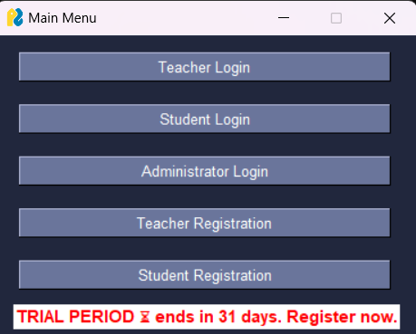
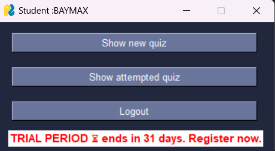
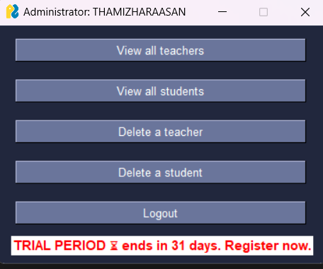

# MCQ Quiz Maker

## Overview

The **MCQ Quiz Maker** is a comprehensive system designed for educators and students to create, manage, and take multiple-choice quizzes. This project allows teachers to create quizzes, store them securely, and enables students to take quizzes and receive their scores. The implementation leverages Python for backend functionality and uses JSON for data organization.

## Objectives

The main objectives of the MCQ Quiz Maker are to:

- Enable user registration and login for both students and teachers.
- Allow teachers to create and manage quizzes.
- Enable students to take quizzes and view their scores.
- Gather functional requirements and design a system that fulfills them.
- Implement the MCQ system in Python.
- Test the system's functionalities to ensure reliability and accuracy.

## Scope

This project focuses on developing a system that allows:

- Teachers to create quizzes.
- Students to take quizzes.
- Visualization of process flow through flowcharts.
- Data management using JSON.

### Platform

- **Programming Language:** Python
- **GUI Framework:** PySimpleGUI
- **Data Management:** JSON for user and question database

## Disclaimer

Please note that **PySimpleGUI** requires users to register an account before accessing the system.
Users still can select the 31 days free trial option to access the system.

## Functional Requirements

### F1. User Registration and Authentication

- **F1.1 Create User Account:** Users can register by filling out a form with their username, password, and user type (teacher or student).
- **F1.2 Login to User Account:** Users can log in using their credentials. Successful login directs them to the main system; otherwise, they can retry.
- **F1.3 Logout from User Account:** Users can log out, which redirects them to the login screen.
- **F1.4 Delete User Account:** Users can delete their account; once deleted, the same username cannot be reused.

### F2. Quiz Module

- **F2.1 Create Quiz:** Teachers can create quizzes by filling out a form. Each quiz includes properties such as name, topic, status, and a unique generated code.
- **F2.2 Edit Quiz:** Teachers can edit existing quizzes, with changes saved to persistent storage or discarded.
- **F2.3 Delete Quiz:** Teachers can delete quizzes by name, removing them from storage.

### F3. Quiz Viewing

- **F3.1 Show Own Quizzes:** Teachers can view all quizzes they have created.
- **F3.2 Show New Quizzes:** Students can view all quizzes they have not attempted.
- **F3.3 Show Attempted Quizzes:** Students can view quizzes they have completed.

### F4. Question Module

- **F4.1 Add Question:** Users can add questions to quizzes by filling out a form with question text, answer, and multiple choices.
- **F4.2 Edit Question:** Teachers can modify existing questions' text, answers, and choices.
- **F4.3 Delete Question:** Teachers can delete specific questions from quizzes after confirmation.

## Implementation

The MCQ Quiz Maker has been implemented using Python, and the data is organized in JSON format for easy access and manipulation.

## Design 

### Main Menu

### Teacher HomePage

### Student HomePage

### Administrator HomePage

